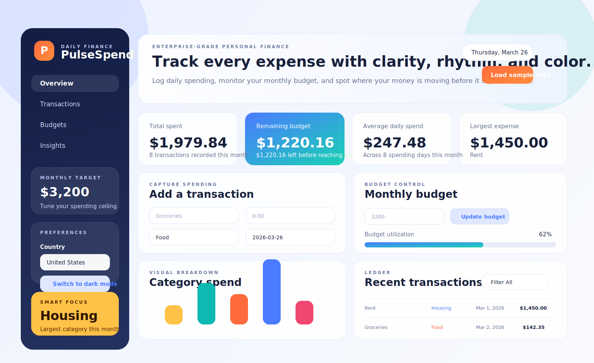

# PulseSpend Expense Tracker

PulseSpend is a polished single-page expense tracker built for daily personal finance use. It combines a vibrant dashboard, category insights, budget tracking, local currency formatting, and light/dark theme support in a lightweight frontend that runs directly in the browser.

[Live demo](https://engineersonal.github.io/codex-project/)



## Highlights

- Add, review, filter, and delete daily expenses from a clean dashboard UI.
- Track a monthly budget with live utilization and remaining balance.
- View category-based spending insights and summary metrics for the current month.
- Switch between country-specific currencies such as USD, GBP, INR, PLN, EUR, CAD, AUD, JPY, and AED.
- Toggle between light mode and dark mode, with preferences saved locally.
- Install the app as a Progressive Web App on supported devices and browsers.
- Load sample data instantly for demos or quick exploration.
- Persist expenses, budget, country, and theme settings in `localStorage`.

## Tech Stack

- HTML5
- CSS3
- Vanilla JavaScript
- Web App Manifest
- Service Worker
- Browser `localStorage` for persistence

## Project Structure

```text
.
|-- index.html   # Application layout and dashboard structure
|-- styles.css   # Visual design, responsive layout, and theme styling
|-- app.js       # App state, rendering, persistence, and interactions
|-- app.webmanifest # PWA metadata for installability
|-- sw.js        # Service worker for offline app shell caching
|-- README.md    # Project documentation
```

## Features

### 1. Expense Management

Users can add new expenses with:

- title
- amount
- category
- date
- optional notes

Saved expenses appear in the transaction ledger and can be deleted individually.

### 2. Budget Tracking

The application lets users define a monthly budget and automatically calculates:

- total spent this month
- remaining budget
- budget utilization percentage
- average daily spend
- largest monthly expense

### 3. Insights and Visualization

PulseSpend summarizes monthly financial activity through:

- top spending category
- transaction count for the month
- recent spending streak
- category spend chart
- quick insight cards

### 4. Country-Based Currency Support

The sidebar includes a country selector. When users switch countries, all amounts across the app are reformatted using that country's locale and currency.

Supported countries currently include:

- United States
- United Kingdom
- India
- Poland
- Germany
- France
- Canada
- Australia
- Japan
- United Arab Emirates

### 5. Light and Dark Theme

The app includes a theme toggle in the sidebar. Theme preference is persisted locally and applied automatically on the next visit.

### 6. Progressive Web App

PulseSpend now behaves like a Progressive Web App on supported browsers.

PWA features include:

- install prompt support
- standalone app experience after installation
- app manifest metadata
- cached app shell for offline loading of the main interface
- custom app icon for install surfaces

## How to Run

This project does not require a build step.

1. Open the project folder.
2. Open [index.html](./index.html) in any modern browser.

You can also use a simple local server if preferred. For example:

```powershell
python -m http.server 8000
```

Then visit `http://localhost:8000`.

For full PWA behavior, serve the app over `http://localhost` or `https` rather than opening the file directly from disk.

## GitHub Pages

This repository is configured to deploy automatically to GitHub Pages with the workflow in [`.github/workflows/deploy-pages.yml`](./.github/workflows/deploy-pages.yml).

Expected site URL:

- `https://engineersonal.github.io/codex-project/`

If GitHub Pages has not been enabled yet in the repository settings, open:

1. `Settings`
2. `Pages`
3. Set the source to `GitHub Actions`

After that, every push to `master` should republish the site automatically.

## Install as an App

When the app is served over GitHub Pages or a local server, supported browsers can install it.

1. Open the site in a supported browser.
2. Use the `Install app` button when it appears, or use the browser install option.
3. Launch PulseSpend from your home screen, desktop, or app launcher.

## How to Use

### Add an Expense

1. Enter a title.
2. Enter the amount.
3. Choose a category.
4. Pick the date.
5. Optionally add notes.
6. Click `Save expense`.

### Set a Budget

1. Enter the monthly budget amount.
2. Click `Update budget`.

### Explore the App

- Click `Load sample data` to populate demo transactions.
- Use the left navigation to switch between Overview, Transactions, Budgets, and Insights.
- Use the transaction filter to narrow expenses by category.
- Delete an entry directly from the ledger when needed.

### Change Currency

1. Use the `Country` selector in the sidebar.
2. The dashboard will immediately reformat all monetary values.

### Change Theme

1. Click the theme toggle button in the sidebar.
2. The interface switches between light and dark mode instantly.

## Data Persistence

PulseSpend stores data in the browser using `localStorage`.

Stored keys include:

- `pulse-spend-expenses`
- `pulse-spend-budget`
- `pulse-spend-country`
- `pulse-spend-theme`

Because the app uses local browser storage:

- data stays on the same browser and device
- clearing browser storage will remove saved data
- there is no backend or cloud sync yet

## Current Behavior Notes

- Summary metrics are calculated for the current month.
- The category chart shows the top spending categories for the current month.
- Sample data is generated using the current month and year.
- Currency formatting changes display values only; it does not perform exchange-rate conversion between currencies.
- Offline support caches the app shell and static assets, but external resources such as hosted fonts may still depend on connectivity.

## Customization Ideas

You can extend the app further with:

- recurring expenses
- multi-user accounts
- CSV or PDF export
- charts by week, month, or year
- income tracking
- savings goals
- real exchange-rate conversion
- backend storage and authentication

## Development Notes

- The UI is intentionally designed as a premium-feeling dashboard rather than a minimal form app.
- The app uses vanilla JavaScript for simplicity and portability.
- All rendering logic is centralized in `app.js`.
- Theme styling is controlled through CSS variables and `body[data-theme="dark"]`.

## Verification

JavaScript syntax was verified with:

```powershell
node --check app.js
```

PWA files added:

- `app.webmanifest`
- `sw.js`
- `assets/pulsespend-icon.svg`

## License

This project currently has no explicit license file. Add one if you plan to distribute or open-source it.
